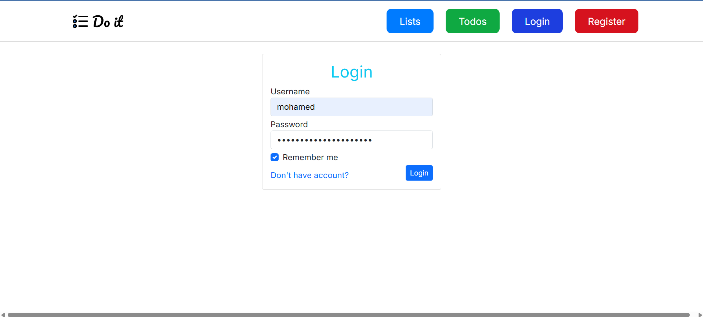
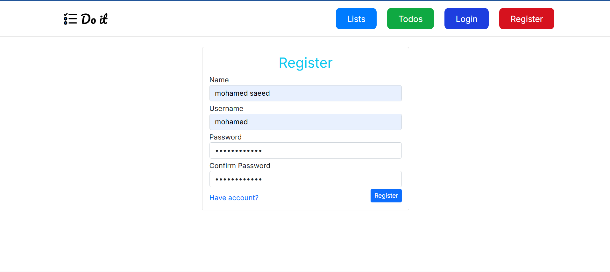

<div align="center">
  <h1>Do it</h1>
  <p>
   A simple CRUD-based task management web app built with ASP.NET MVC</p>
</div>

<!-- PROJECT Badges -->
<div align="center">
  <a href="https://github.com/mohamedsaeed138/Do-it-TodoApp-CRUD-MVC/stargazers"></a>
<a href="https://github.com/mohamedsaeed138/Do-it-TodoApp-CRUD-MVC/network/members"></a>
<a href="https://github.com/mohamedsaeed138/Do-it-TodoApp-CRUD-MVC/pulls"></a>
<a href="https://github.com/mohamedsaeed138/Do-it-TodoApp-CRUD-MVC/issues"></a>
<a href="https://github.com/mohamedsaeed138/Do-it-TodoApp-CRUD-MVC/graphs/contributors"></a>
<a href="https://github.com/mohamedsaeed138/Do-it-TodoApp-CRUD-MVC/blob/main/LICENSE.txt"></a>
</div>

## 📌 Overview

This project is a **CRUD (Create, Read, Update, Delete) task management system** that allows users to efficiently manage their to-do lists. It was developed as a learning exercise in building full-stack web applications using **ASP.NET MVC** for my **Computer Science Summer Training 2024** at **Suez University**.

## 🚀 Features

- 📝 Maintain a structured list of to-dos
- ✅ Create, update, and delete tasks with due dates
- 📌 Organize tasks with priority levels
- ⏳ Track task status (Pending, In Progress, Completed)
- 🔒 Secure user authentication using ASP.NET Identity
- 🔍 Advanced search and filtering options: filter tasks by status, priority, due date, list name, and keywords
- 📊 Persistent storage with Entity Framework Core and SQL Server
- 📱 Responsive UI with Bootstrap

## 🛠️ Technologies Used

- ASP.NET MVC
- C#
- Entity Framework Core
- SQL Server
- Bootstrap (for UI styling)
- ASP.NET Identity (for authentication)
- LINQ (for data querying)

## 🏷️ Installation

### Prerequisites

- .NET SDK (latest version) [Download here](https://dotnet.microsoft.com/download)
- Microsoft SQL Server [Download here](https://www.microsoft.com/en-us/sql-server/sql-server-downloads)
- Visual Studio (or another IDE with .NET support)

### 🔥 Setup Guide

1. **Clone the repository:**

   ```sh
   git clone https://github.com/mohamedsaeed138/Do-it-TodoApp-CRUD-MVC.git
   cd Do-it-TodoApp-CRUD-MVC
   ```

2. **Restore dependencies:**

   ```sh
   dotnet restore
   ```

3. **Set up the database:**

   ```sh
   dotnet ef database update
   ```

4. **Run the application:**

   ```sh
   dotnet run
   ```

## 🎮 Usage

1. Launch the application (`dotnet run`).
2. Open a web browser and navigate to `http://localhost:5000`.
3. Register or log in using the authentication system.
4. Add, edit, and delete tasks from the task list page.
5. Track task status and priority levels.

## 📸 Screenshots

Here are some screenshots showcasing the app's features:

### 🔑 Authentication


<p>🔐 Login Page</p>


<p>📝 Register Page</p>

### 📋 Todo Lists


<p>📌 Todo Lists Overview</p>


<p>✏️ Edit Todo List</p>

### ✅ Managing Todos


<p>📋 Todos Overview</p>


<p>➕ Create a New Todo</p>

## 📝 License

This project is licensed under the MIT License - see the [LICENSE](LICENSE.txt) file for details.

## 💡 Notes

- Ensure database migrations are applied before running the application.
- Modify `appsettings.Development.json` for local development settings.
